# 8.-Inprocode-Angular

## 📄 Descripción - Enunciado del ejercicio

Este proyecto es una aplicación web desarrollada con **Angular y Node.js (Express)** que permite **gestionar una colección de videojuegos**, consultar información externa y analizar precios de mercado a tiempo real.

La aplicación permite al usuario:

- Registrar videojuegos en una base de datos local.
- Obtener información de juegos desde [**IGDB**](https://www.igdb.com).
- Analizar precios reales de mercado mediante [**eBay**](https://www.ebay.es/?mkcid=1&mkrid=1185-53479-19255-0&siteid=186&campid=5337315324&customid=gxesebayebaysd&toolid=10001&mkevt=1).
- Localizar tiendas cercanas que venden videojuegos.
- Planificar recordatorios relacionados con su colección.

El objetivo principal del proyecto es practicar una **arquitectura Full Stack moderna**, integrando un **frontend en Angular** con un **backend en Node.js**, utilizando múltiples **APIs externas**, base de datos **MySQL**, y visualización avanzada de datos.

---

## ✨ Funcionalidades

### Gestión de videojuegos

- Crear videojuegos en la base de datos local.
- Editar información de un juego.
- Eliminar juegos.
- Visualizar toda la colección registrada.
- Guardar información como:
  - Nombre.
  - Plataforma.
  - Región.
  - Género.
  - Fecha de lanzamiento.
  - Precio medio de mercado.
  - Imagen.

### Búsqueda de información externa (IGDB)

La aplicación puede buscar información de videojuegos mediante la API de **IGDB**.

Datos obtenidos automáticamente:

- Nombre del juego.
- Género.
- Plataforma.
- Fecha de lanzamiento.
- Imagen del juego.

Esto permite **completar automáticamente información del juego** al añadirlo a la colección.

### Análisis de precios de mercado (eBay)

El backend consulta **eBay Marketplace API** para analizar precios reales.

Funciones:

- Cálculo del **precio medio (mediana)** de un juego.
- Conversión automática de divisas a **EUR**.
- Análisis de **hasta 800 anuncios de eBay**.

La aplicación puede mostrar:

- Precio medio estimado.
- Número de anuncios analizados.
- Histograma de precios.

Esto permite saber **cuánto vale realmente un juego en el mercado actual**.

### Localización de tiendas cercanas

El sistema permite buscar **tiendas físicas cercanas** que podrían vender videojuegos.

Utiliza:

- **OpenStreetMap**.
- **Overpass API**.

Información mostrada:

- Nombre de la tienda.
- Ubicación en mapa.
- Web oficial.
- Teléfono.
- Horario de apertura.
- Probabilidad de que vendan videojuegos.

Clasificación de probabilidad:

- **High** → tiendas especializadas o segunda mano.
- **Medium** → grandes superficies o electrónica.
- **Low** → tiendas generales.

### Cálculo de rutas

La aplicación puede calcular **la ruta a pie hacia una tienda** usando:

**OSRM (Open Source Routing Machine)**

Se calcula:

- Distancia.
- Tiempo estimado.
- Ruta mostrada en el mapa.

### Sistema de recordatorios

La aplicación incluye un sistema de **recordatorios con calendario**.

Permite:

- Crear recordatorios.
- Asociarlos a videojuegos.
- Añadir notas.
- Visualizarlos en calendario.

Ejemplos:

- Comprar un juego.
- Evento gaming.
- Lanzamiento de un juego.
- Recordatorio de colección.

### Visualización de datos

El sistema puede mostrar:

- Distribución de precios de eBay.
- Gráficos de mercado.
- Comparación de precios.

Esto ayuda a **analizar el valor real de una colección**.

---

## 🏗️ Arquitectura del proyecto

El proyecto está dividido en **Frontend (Angular)** y **Backend (Node.js)**:

### FRONTEND

```bash
src/
├── app/
│ ├── core/
│ │ ├── models/
│ │ │ ├── game.model.ts
│ │ │ └── reminder.model.ts
│ │ └── services/
│ │   ├── games.service.ts / spec.ts
│ │   ├── map.service.ts / spec.ts
│ │   └── reminder.service.ts / spec.ts
│ ├── features/
│ │ └── calendar/
│ │   └── calendar.component.ts / spec.ts / .html / .scss
│ │ └── graphics/
│ │   └── graphics.component.ts / spec.ts / .html / .scss
│ │ └── home/
│ │   └── home.component.ts / spec.ts / .html / .scss
│ │ └── map/
│ │   └── map.component.ts / spec.ts / .html / .scss
│ ├── shared/
│ │ └── components/
│ │  └── components/
│ │   └── navbar.component.ts / .scss / .spec.ts / .html
│ ├── app.routes.ts
│ ├── app.ts / html / scss
│ └── app.config.ts
├── assets/
│ ├── marker-icon-2x.png
│ ├── marker-icon.png
│ ├── marker-shadow.png
│ ├── marker-store-icon-2x.png
│ └── marker-store-icon.png
├── main.ts
├── index.html
└── styles.scss
```

### BACKEND

```bash
backend/
├── src/
│ ├── routes/
│ │ ├── games.routes.js
│ │ └── reminders.routes.js
│ ├── services/
│ │ ├── igdb.service.js
│ │ ├── ebay.service.js
│ │ ├── geocoding.service.js
│ │ └── overpass.service.js
│ ├── db.js
│ └── app.js
└── .env
```

---

## 🗄️ Base de datos

El backend utiliza **MySQL**.

Tablas principales:

### games

| Campo       | Tipo    |
| ----------- | ------- |
| id          | INT     |
| name        | VARCHAR |
| platform    | VARCHAR |
| region      | VARCHAR |
| genre       | VARCHAR |
| releaseDate | DATE    |
| avgPrice    | FLOAT   |
| image       | TEXT    |

---

### reminders

| Campo  | Tipo    |
| ------ | ------- |
| id     | INT     |
| title  | VARCHAR |
| date   | DATE    |
| notes  | TEXT    |
| gameId | INT     |

---

## 🎨 Decisiones de diseño

- **Minimalismo visual**
  - Uso de Bootstrap y SCSS modular para un diseño limpio y legible.

- **Responsive Design**
  - Adaptado a móviles y escritorio, con tarjetas flexibles para películas.

- **UX clara**
  - Mensajes de funcionamiento básico del programa.
  - Uso de colores minimalistas para la visualización rápida del usuario.

- **Signals en Angular 20**
  - Evita suscripciones manuales y optimiza la actualización de vistas.

---

## ⚠️ Limitaciones conocidas

- Dependencia de APIs externas, las cuales **pueden llegar a ser de pago**.

- No hay **autentitación de usuarios**.

- No hay almacenamiento en la nube.

- Precisión de tiendas depende **únicamente** de OpenStreetMap.

---

## 🚀 Roadmap / Mejoras futuras

- Sistema de **usuarios y autenticación**.

- **Listas de colección y organización profunda**.

- Busqueda de juego en la colección mediante **un buscador**.

- **Mejorar la interfaz** con animaciones y mejora visual.

---

## 💻 Tecnologías utilizadas

### Frontend

- [Angular](https://angular.dev)
- [TypeScript](https://www.typescriptlang.org)
- HTML
- SCSS
- [Bootstrap](https://getbootstrap.com)
- [FullCalendar](https://fullcalendar.io)

### Backend

- [Node.js](https://nodejs.org/es)
- Express
- [MySQL](https://www.mysql.com)
- dotenv
- CORS

### APIs externas

- [IGDB API](https://www.igdb.com/api)
- [eBay Marketplace API](https://developer.ebay.com/develop)
- OpenStreetMap
- Overpass API
- [OSRM Routing API](https://project-osrm.org/docs/v5.24.0/api/#)

---

## 📋 Requisitos

Para ejecutar este proyecto se necesita:

- Node.js (v18 o superior)
- MySQL instalado en tu ordenador.
- Angular CLI instalado globalmente
  ```bash
  npm install -g @angular/cli
  ```
- Un editor de código (recomendado: _Visual Studio Code_)
- Un navegador moderno (_Chrome, Edge, Firefox, OperaGX, etc_)

---

## ⚙️ Configuración

Crea un archivo `.env` en la carpeta **backend**.

Estructura:

```bash
PORT=3000

DB_HOST=localhost
DB_USER=root
DB_PASSWORD=tu_password
DB_NAME=video_games

IGDB_CLIENT_ID=tu_client_id
IGDB_CLIENT_SECRET=tu_client_secret

EBAY_CLIENT_ID=tu_client_id
EBAY_CLIENT_SECRET=tu_client_secret
```

---

## 🛠️ Instalación

1.  Clona el repositorio o descarga los archivos ZIP:

```bash
git clone https://github.com/Alex-Gesti-FrontEnd/8.-Inprocode-Angular
```

2.  Abre la carpeta del proyecto en tu editor de código.

3.  Instala las dependencias de **frontend**:

```bash
npm install
```

4.  Instala las dependencias de **backend**:

```bash
cd ./backend
npm install
```

---

## Ejecución

### 🖥️ Modo desarrollo

1. Inicia el servidor de **Backend**:

```bash
npm run dev
```

2. Inicia el servidor de **Frontend**:

```bash
ng serve
```

3. Abre el navegador y entra en http://localhost:4200.

---

### 🧪 Testing

1. Ejecuta los tests con:

```bash
npm test
```

2. La consola del editor de código mostrando los resultados de las pruebas unitarias (éxitos, fallos y logs detallados).

---

## 🖼️ Screenshots

A continuación se mostrará algunas capturas de la aplicación en funcionamiento:

- **Pantalla _Home_**

  <p align="center">
  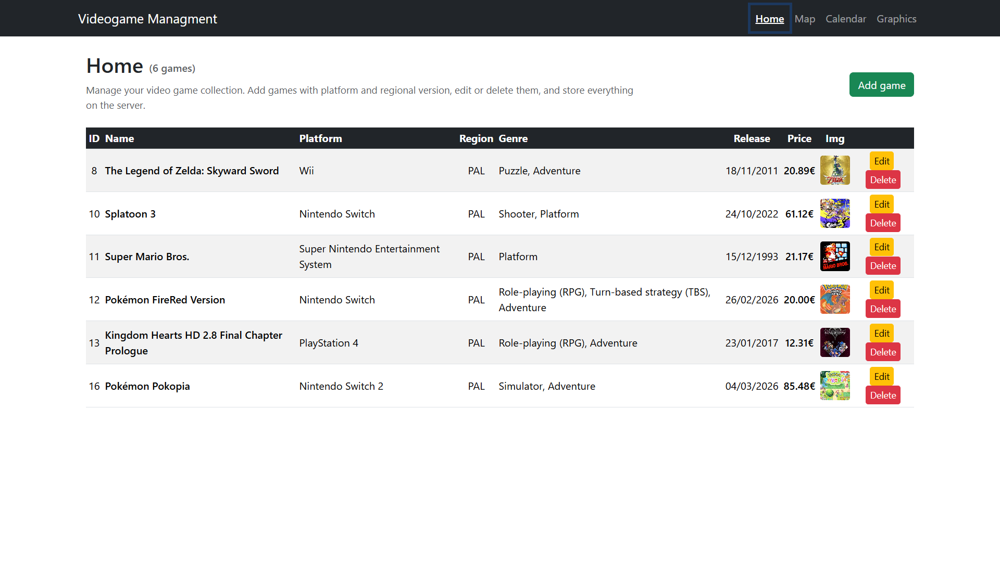
    </p>
    
  - **_Add game_ abierto**

      <p align="center">
      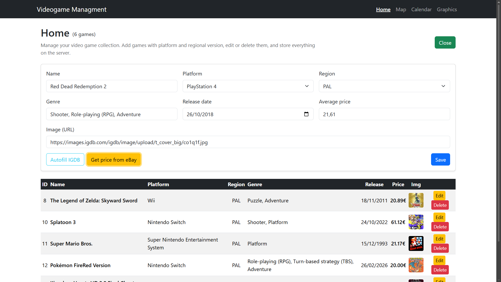

    </p>

- **Pantalla _Game Store Map_**

<p align="center">
      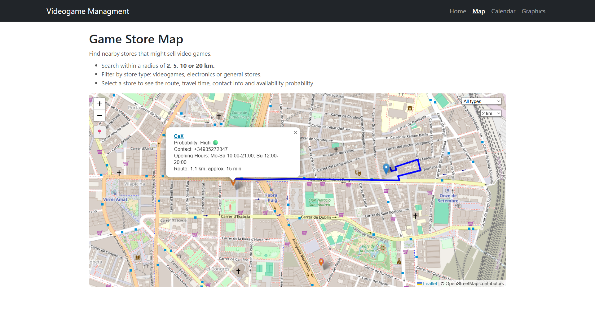
</p>

- **Pantalla _Calendar_**
  - **Mes**

    <p align="center">
      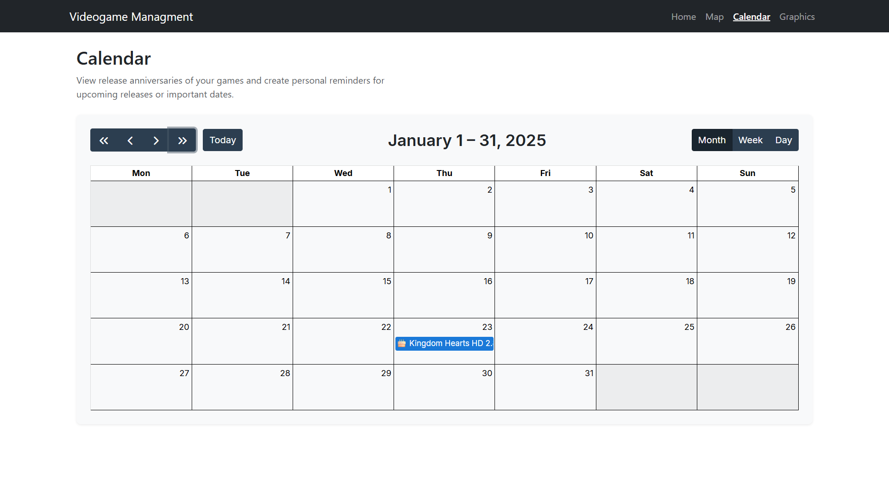
  </p>

  - **Semana**

    <p align="center">
      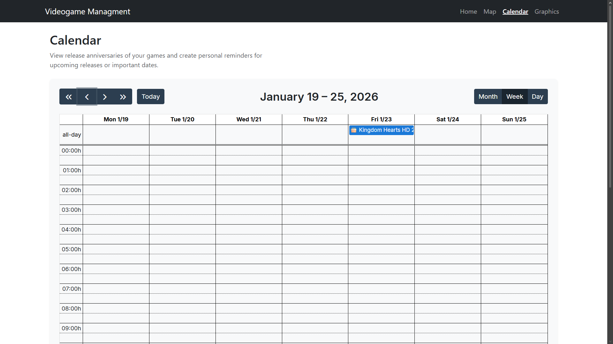
  </p>

  - **Día**

    <p align="center">
      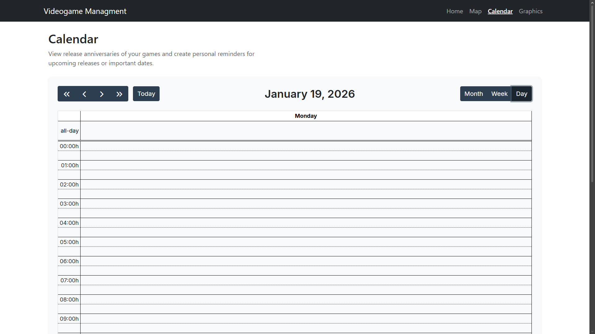
  </p>

  - **Evento de aniversario**

    <p align="center">
      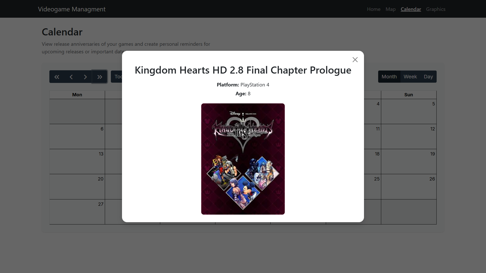
  </p>

  - **Añadir evento**

    <p align="center">
      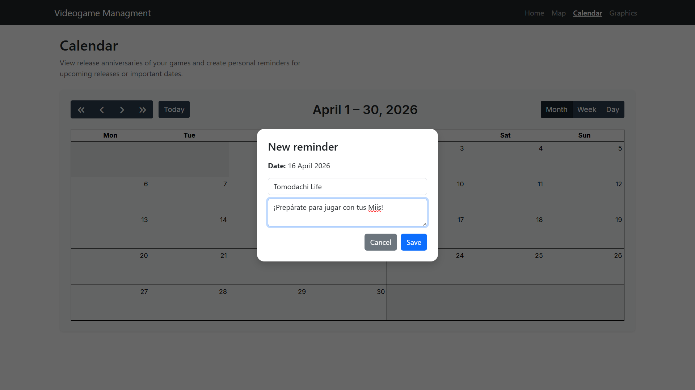
  </p>
  <p align="center">
      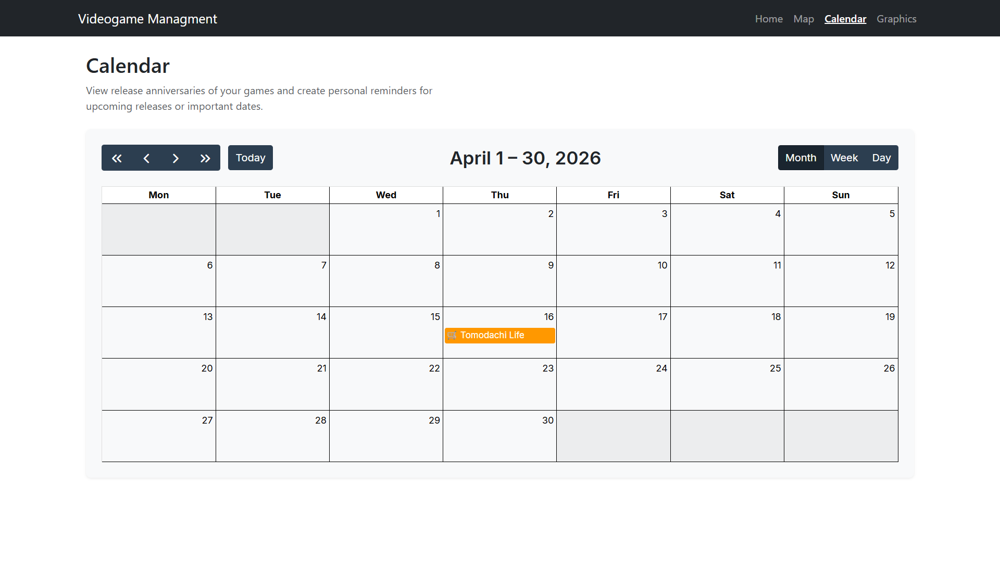
  </p>
  <p align="center">
      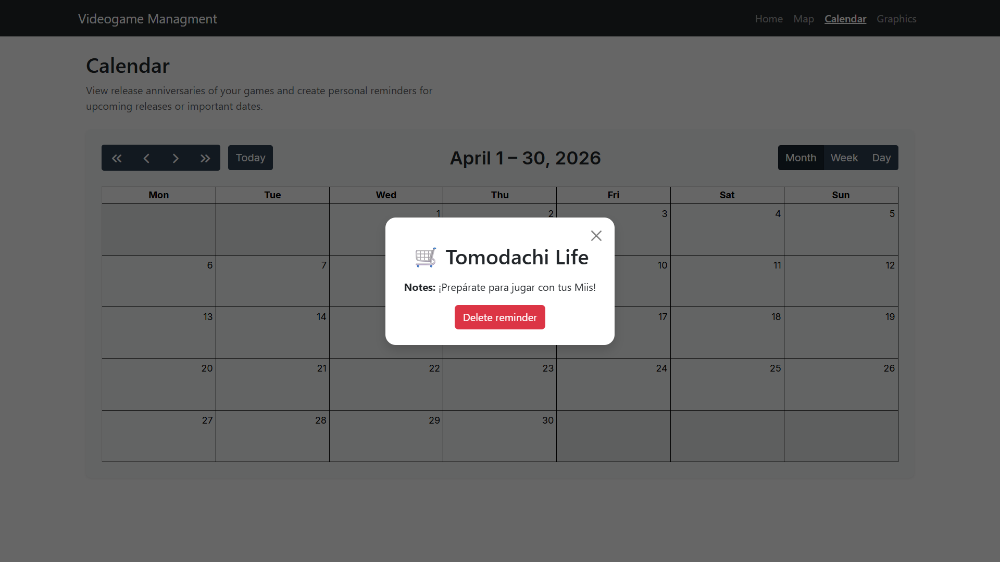
  </p>

- **Pantalla _Graphics_**

<p align="center">
      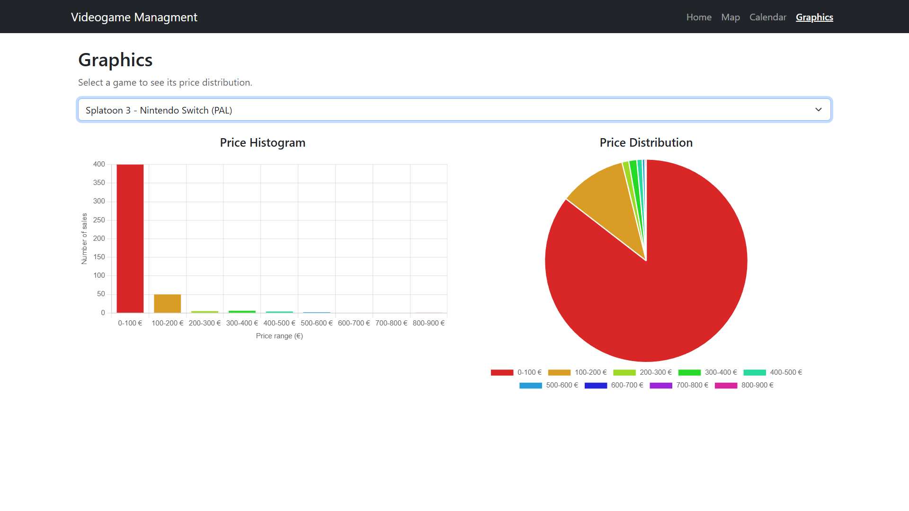
</p>

- **Formato móvil**

<p align="center">
      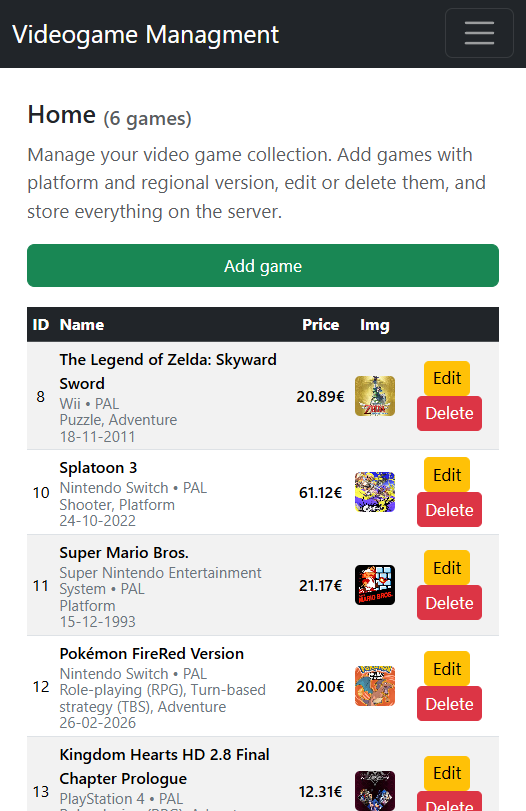
</p>

<p align="center">
      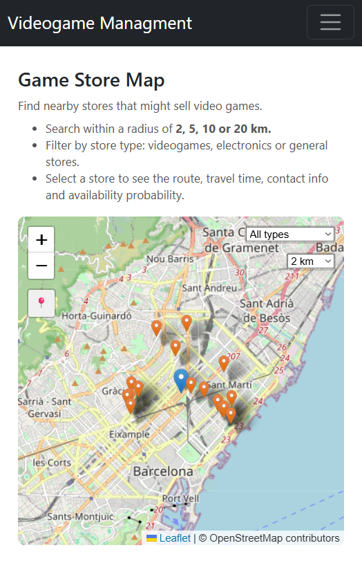
</p>

<p align="center">
      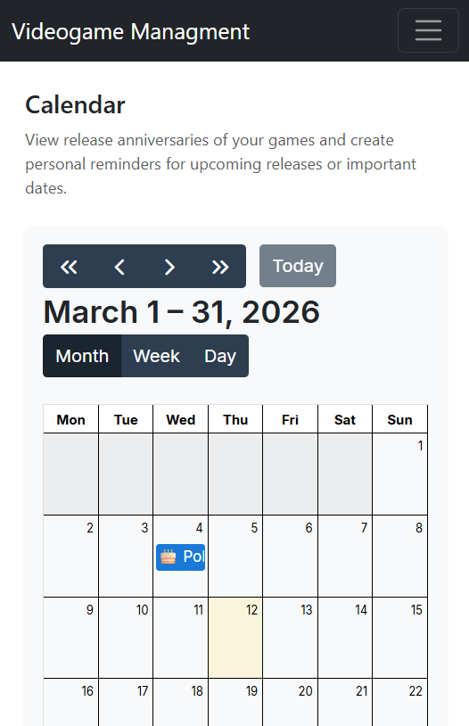
</p>

<p align="center">
      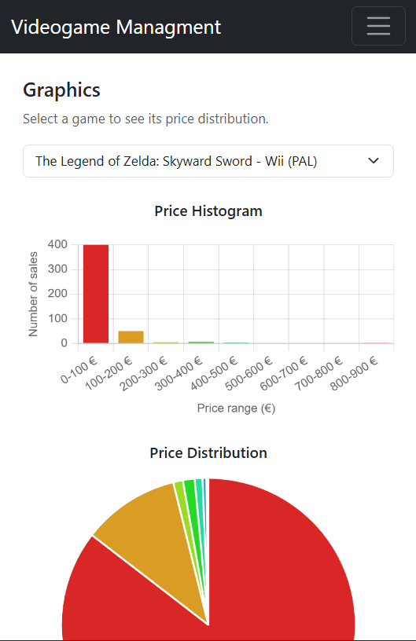
</p>

---

## 🌐 Demo Online

Puedes probar la aplicación directamente en tu navegador, sin necesidad de instalar nada:

[**Abrir Demo**](https://videogamesdb-36fc5.web.app)

---

## © Derechos de autor

© 2026 [Alex Gesti](https://github.com/alexgesti) — Todos los derechos reservados.
