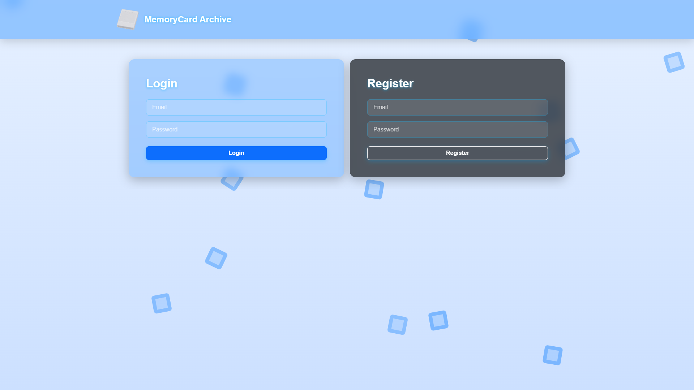
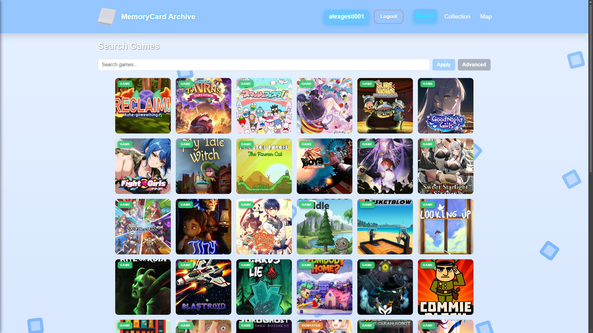
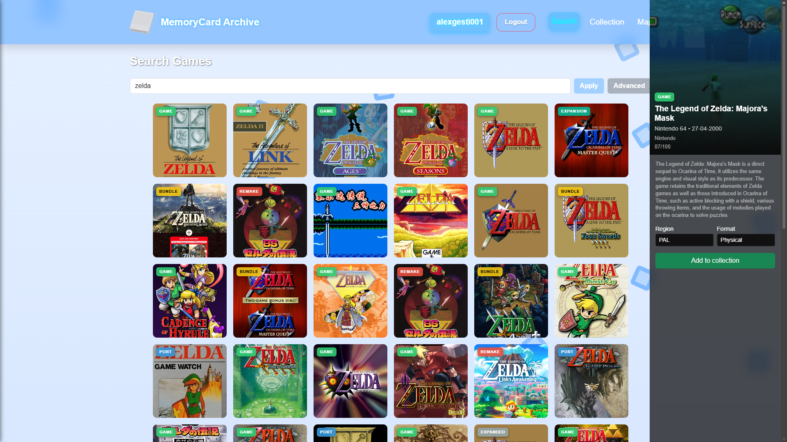
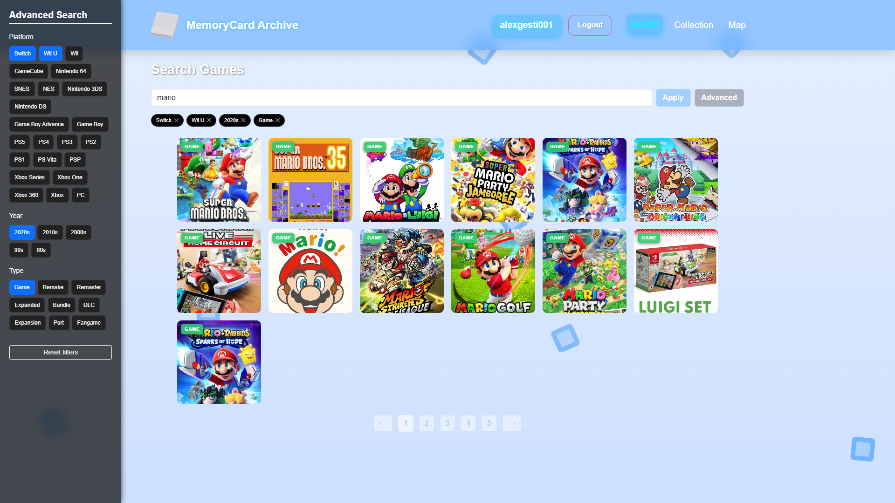
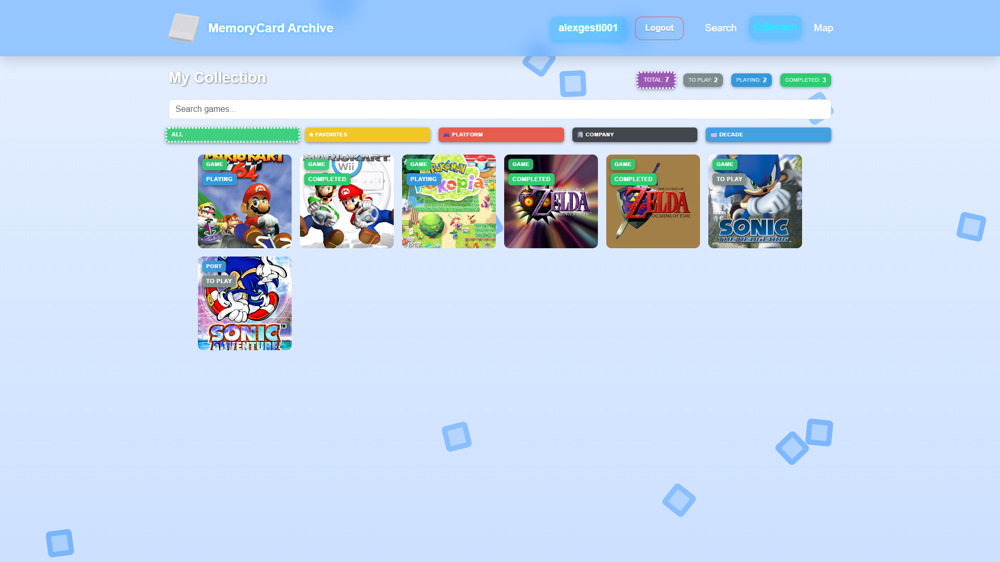
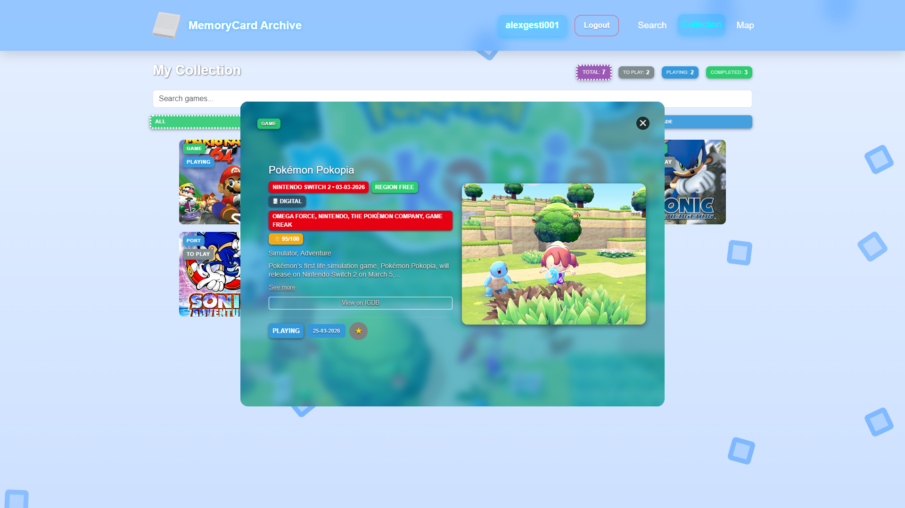
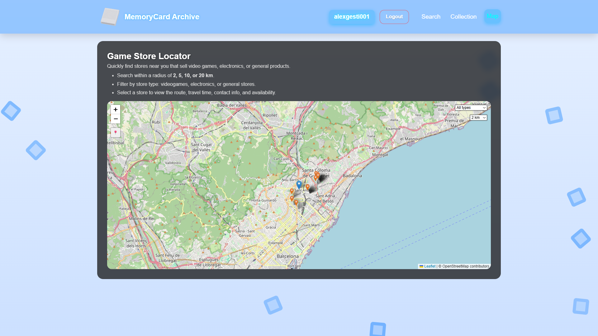

# MemoryCard Archive

## 📄 Descripción

Este proyecto es una aplicación web desarrollada con **Angular y Node.js (Express)** que permite **gestionar una colección de videojuegos**, consultar información externa y analizar precios de mercado a tiempo real.

La aplicación permite al usuario:

- Obtener información de juegos desde [**IGDB**](https://www.igdb.com).
- Organizar los juegos en su base de datos propia privada.
- Localizar tiendas cercanas que venden videojuegos.

El objetivo principal del proyecto es practicar una **arquitectura Full Stack moderna**, integrando un **frontend en Angular** con un **backend en Node.js**, utilizando múltiples **APIs externas**, base de datos **MySQL**, y visualización avanzada de datos.

---

## ✨ Funcionalidades

### Gestión de videojuegos

- Buscar videojuegos en la base de datos.
- Eliminar juegos.
- Visualizar, organizar y controlar toda la colección registrada.
- Guardar información completa del videojuego.
- Guardar el estado en el cual el jugador se encuentra y que versión de juego tiene.

### Búsqueda de información externa (IGDB)

La aplicación puede buscar información de videojuegos mediante la API de **IGDB**.
Esto permite **completar automáticamente información del juego** al añadirlo a la colección.

### Control de colección propia

El sistema puede guardar y mostrar:

- Videojuego registrado.
- Versión registrada.
- Formato del videojuego.
- Información del videojuego, desde en la consola se lanzó hasta rating de este propio.

Esto ayuda a **controlar y conocer la colección del usuario**.

### Localización de tiendas cercanas

El sistema permite buscar **tiendas físicas cercanas** que podrían vender videojuegos.

Utiliza:

- **OpenStreetMap**.
- **Overpass API**.

Información mostrada:

- Nombre de la tienda.
- Ubicación en mapa.
- Web oficial.
- Teléfono.
- Horario de apertura.
- Probabilidad de que vendan videojuegos.

Clasificación de probabilidad:

- **High** → tiendas especializadas o segunda mano.
- **Medium** → grandes superficies o electrónica.
- **Low** → tiendas generales.

### Cálculo de rutas

La aplicación puede calcular **la ruta a pie hacia una tienda** usando:

**OSRM (Open Source Routing Machine)**

Se calcula:

- Distancia.
- Tiempo estimado.
- Ruta mostrada en el mapa.

---

## 🏗️ Arquitectura del proyecto

El proyecto está dividido en **Frontend (Angular)** y **Backend (Node.js)**:

### FRONTEND

```bash
src/
├── app/
│ ├── core/
│ │ ├── guards/
│ │ │ └── auth.guard.ts
│ │ ├── interceptors/
│ │ │ └── auth.interceptor.ts
│ │ ├── models/
│ │ │ ├── game.model.ts
│ │ │ └── reminder.model.ts
│ │ └── services/
│ │   ├── auth.service.ts
│ │   ├── games.service.ts
│ │   ├── map.service.ts
│ │   └── reminder.service.ts
│ ├── features/
│ │ ├── calendar/
│ │ │ └── calendar.component.ts  / .html / .scss
│ │ ├── collection/
│ │ │ └── collection.component.ts / .html / .scss
│ │ ├── home/
│ │ │ └── home.component.ts / .html / .scss
│ │ ├── login/
│ │ │ └── login.component.ts / .html / .scss
│ │ └── map/
│ │   └── map.component.ts / .html / .scss
│ ├── shared/
│ │ └── components/
│ │  └── components/
│ │   └── navbar.component.ts / .scss / .html
│ ├── app.routes.ts
│ ├── app.ts / html / scss
│ └── app.config.ts
├── assets/
│ ├── logo_icon.png
│ ├── logo_title.png
│ ├── marker-icon-2x.png
│ ├── marker-icon.png
│ ├── marker-shadow.png
│ ├── marker-store-icon-2x.png
│ └── marker-store-icon.png
├── main.ts
├── index.html
└── styles.scss
```

### BACKEND

```bash
backend/
├── src/
│ ├── middleware/
│ │ └── auth.middleware.js
│ ├── routes/
│ │ ├── auth.routes.js
│ │ ├── games.routes.js
│ │ └── reminders.routes.js
│ ├── services/
│ │ ├── igdb.service.js
│ │ ├── geocoding.service.js
│ │ └── overpass.service.js
│ ├── db.js
│ └── app.js
└── .env
```

---

## 🗄️ Base de datos

El backend utiliza **MySQL**.

Tablas principales:

### games

| Campo       | Tipo      |
| ----------- | --------- |
| id          | INT       |
| name        | VARCHAR   |
| platform    | VARCHAR   |
| region      | VARCHAR   |
| genre       | VARCHAR   |
| releaseDate | DATE      |
| image       | TEXT      |
| created_at  | TIMESTAMP |
| status      | ENUM      |
| format      | ENUM      |
| game_url    | TEXT      |
| game_type   | INT       |
| summary     | TEXT      |
| rating      | FLOAT     |
| screenshots | JSON      |
| artworks    | JSON      |
| companies   | JSON      |
| startedAt   | DATE      |
| completedAt | DATE      |
| favourite   | INT       |

---

### users

| Campo      | Tipo      |
| ---------- | --------- |
| id         | INT       |
| email      | VARCHAR   |
| password   | VARCHAR   |
| created_at | TIMESTAMP |

---

## 🎨 Decisiones de diseño

- **Interfaz temática**
  - Uso de Bootstrap y SCSS modular para un diseño limpio y legible con un toque de interfaz única.

- **Responsive Design**
  - Adaptado a móviles y escritorio, con tarjetas flexibles para videojuegos.

- **UX clara**
  - Mensajes de funcionamiento básico del programa.
  - Uso de colores minimalistas para la visualización rápida del usuario.

---

## ⚠️ Limitaciones conocidas

- Dependencia de APIs externas, las cuales **pueden llegar a ser de pago**.

- Almacenamiento en la nube limitado.

- Precisión de tiendas depende **únicamente** de OpenStreetMap.

---

## 🚀 Roadmap / Mejoras futuras

- **Ventana home** para nuevos usuarios.

- **Ventana FAQS** para resolución de dudas.

- Creación de **foros** para que los usuarios puedan charlar entre ellos.

- Creación de un **perfil de usuario** propio y customizable.

- Inicio de un **marketplace** regulado y interactivo entre usuarios.

- Mejoras de **organización de colección** en la ventana _Collection_.

- Nuevos **temas** para la web.

- Mejora y depuración de **código** en profundidad.

---

## 💻 Tecnologías utilizadas

### Frontend

- [Angular](https://angular.dev)
- [TypeScript](https://www.typescriptlang.org)
- HTML
- SCSS
- [Bootstrap](https://getbootstrap.com)
- [FullCalendar](https://fullcalendar.io)
- [Firebase](https://firebase.google.com/?hl=es-419)

### Backend

- [Node.js](https://nodejs.org/es)
- Express
- [MySQL](https://www.mysql.com)
- dotenv
- [Railway](https://railway.com)

### APIs externas

- [IGDB API](https://www.igdb.com/api)
- OpenStreetMap
- Overpass API
- [OSRM Routing API](https://project-osrm.org/docs/v5.24.0/api/#)

---

## 📋 Requisitos

Para ejecutar este proyecto en local se necesita:

- Node.js (v18 o superior)
- MySQL instalado en tu ordenador.
- Angular CLI instalado globalmente
  ```bash
  npm install -g @angular/cli
  ```
- Un editor de código (recomendado: _Visual Studio Code_)
- Un navegador moderno (_Chrome, Edge, Firefox, OperaGX, etc_)

---

## ⚙️ Configuración

Crea un archivo `.env` en la carpeta **backend**.

Estructura:

```bash
PORT=3000

DB_HOST=localhost
DB_PORT=tu_puerto
DB_USER=root
DB_PASSWORD=tu_password
DB_NAME=video_games

JWT_SECRET=tu_contraseña_secreta

IGDB_CLIENT_ID=tu_client_id
IGDB_CLIENT_SECRET=tu_client_secret

```

---

## 🛠️ Instalación

1.  Clona el repositorio o descarga los archivos ZIP:

```bash
git clone https://github.com/Alex-Gesti-FrontEnd/MemoryCard-Archive
```

2.  Abre la carpeta del proyecto en tu editor de código.

3.  Instala las dependencias de **frontend**:

```bash
npm install
```

4.  Instala las dependencias de **backend**:

```bash
cd ./backend
npm install
```

---

## Ejecución

### 🖥️ Modo desarrollo

1. Inicia el servidor de **Backend**:

```bash
npm run dev
```

2. Inicia el servidor de **Frontend**:

```bash
ng serve
```

3. Abre el navegador y entra en http://localhost:4200.

---

## 🖼️ Screenshots

A continuación se mostrará algunas capturas de la aplicación en funcionamiento:

- **Pantalla _Login_**

  <p align="center">
  
    </p>

- **Pantalla _Search_**

  <p align="center">
  
    </p>
    
  - **_Information game_ abierto**

      <p align="center">
      

    </p>
  - **_Advance search_ abierto**

    <p align="center">
    

    </p>

- **Pantalla _Collection_**

  <p align="center">
  
    </p>
    
  - **_Game on collection_ abierto**

      <p align="center">
      

    </p>

- **Pantalla _Game Store Map_**

<p align="center">
      
</p>

---

## 🌐 Demo Online

Puedes probar la aplicación directamente en tu navegador, sin necesidad de instalar nada:

[**Abrir Demo**](https://memorycard-frontend.web.app)

---

## © Derechos de autor

© 2026 [Alex Gesti](https://github.com/alexgesti) — Todos los derechos reservados.
